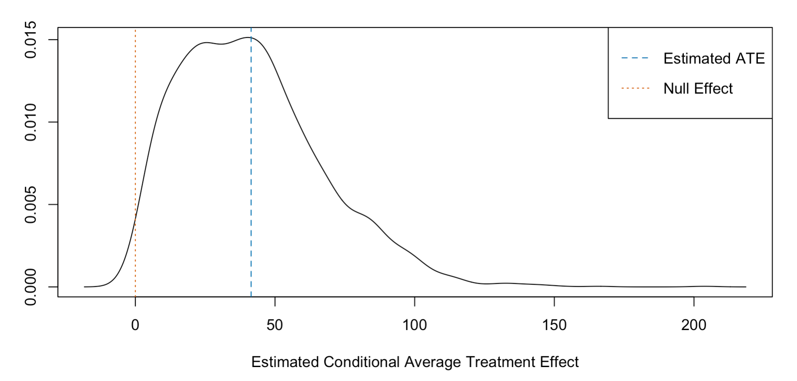
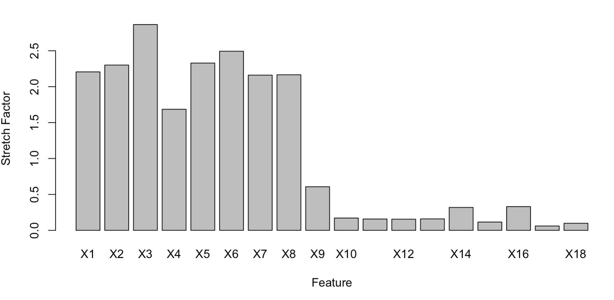
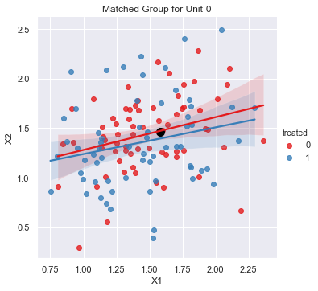
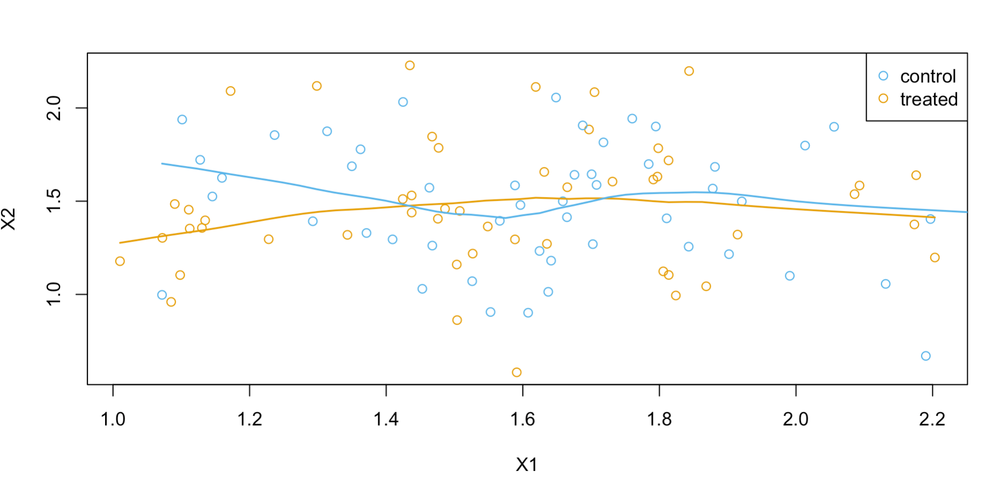
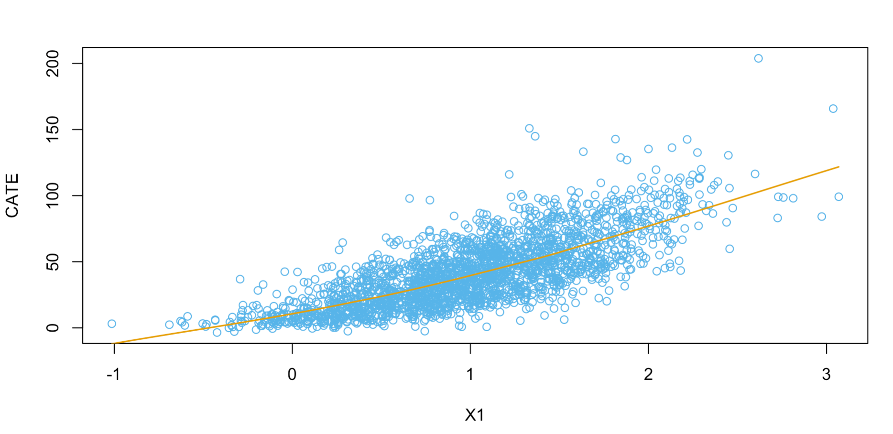

# Introduction

MALTS is a learning-to-match method for interpretable causal inference proposed by Harsh Parikh, Cynthia Rudin and Alexander Volfovsky in their 2019 paper ["MALTS: Matching After Learning to Stretch"](https://www.jmlr.org/papers/volume23/21-0053/21-0053.pdf). This repository contains `PyMALTS` and `MALTS`, Python and R implementations, respectively, of the MALTS algorithm.  

## Setup
### Dependencies
**Python**

`PyMALTS` is a Python3 library and it requires `numpy`, `pandas`, `scipy`, `scikit-learn`, `matplotlib` and `seaborn`.

**R**

`MALTS` requires `nloptr` for distance metric learning.

### Installation
**Python**
```python
pip install git+https://github.com/almost-matching-exactly/MALTS.git
```
**R**
```R
devtools::install_github('https://github.com/almost-matching-exactly/MALTS', 
                         subdir = 'RMALTS/MALTS')
```

### Importing
**Python**
```python
import pymalts
import numpy as np
import pandas as pd
import matplotlib.pyplot as plt
import seaborn as sns
np.random.seed(0)
sns.set()
```

**R**
```R
library(MALTS)
```

## Reading Data
**Python**

```python
df = pd.read_csv('example/example_data.csv',index_col=0)
print(df.shape)
df.head()
```

    (2500, 20)
    


<div>
<table border="1" class="dataframe">
  <thead>
    <tr style="text-align: right;">
      <th></th>
      <th>X1</th>
      <th>X2</th>
      <th>X3</th>
      <th>X4</th>
      <th>X5</th>
      <th>X6</th>
      <th>X7</th>
      <th>X8</th>
      <th>X9</th>
      <th>X10</th>
      <th>X11</th>
      <th>X12</th>
      <th>X13</th>
      <th>X14</th>
      <th>X15</th>
      <th>X16</th>
      <th>X17</th>
      <th>X18</th>
      <th>outcome</th>
      <th>treated</th>
    </tr>
  </thead>
  <tbody>
    <tr>
      <th>1355</th>
      <td>1.881335</td>
      <td>1.684164</td>
      <td>0.532332</td>
      <td>2.002254</td>
      <td>1.435032</td>
      <td>1.450196</td>
      <td>1.974763</td>
      <td>1.321659</td>
      <td>0.709443</td>
      <td>-1.141244</td>
      <td>0.883130</td>
      <td>0.956721</td>
      <td>2.498229</td>
      <td>2.251677</td>
      <td>0.375271</td>
      <td>-0.545129</td>
      <td>3.334220</td>
      <td>0.081259</td>
      <td>-15.679894</td>
      <td>0</td>
    </tr>
    <tr>
      <th>1320</th>
      <td>0.666476</td>
      <td>1.263065</td>
      <td>0.657558</td>
      <td>0.498780</td>
      <td>1.096135</td>
      <td>1.002569</td>
      <td>0.881916</td>
      <td>0.740392</td>
      <td>2.780857</td>
      <td>-0.765889</td>
      <td>1.230980</td>
      <td>-1.214324</td>
      <td>-0.040029</td>
      <td>1.554477</td>
      <td>4.235513</td>
      <td>3.596213</td>
      <td>0.959022</td>
      <td>0.513409</td>
      <td>-7.068587</td>
      <td>0</td>
    </tr>
    <tr>
      <th>1233</th>
      <td>-0.193200</td>
      <td>0.961823</td>
      <td>1.652723</td>
      <td>1.117316</td>
      <td>0.590318</td>
      <td>0.566765</td>
      <td>0.775715</td>
      <td>0.938379</td>
      <td>-2.055124</td>
      <td>1.942873</td>
      <td>-0.606074</td>
      <td>3.329552</td>
      <td>-1.822938</td>
      <td>3.240945</td>
      <td>2.106121</td>
      <td>0.857190</td>
      <td>0.577264</td>
      <td>-2.370578</td>
      <td>-5.133200</td>
      <td>0</td>
    </tr>
    <tr>
      <th>706</th>
      <td>1.378660</td>
      <td>1.794625</td>
      <td>0.701158</td>
      <td>1.815518</td>
      <td>1.129920</td>
      <td>1.188477</td>
      <td>0.845063</td>
      <td>1.217270</td>
      <td>5.847379</td>
      <td>0.566517</td>
      <td>-0.045607</td>
      <td>0.736230</td>
      <td>0.941677</td>
      <td>0.835420</td>
      <td>-0.560388</td>
      <td>0.427255</td>
      <td>2.239003</td>
      <td>-0.632832</td>
      <td>39.684984</td>
      <td>1</td>
    </tr>
    <tr>
      <th>438</th>
      <td>0.434297</td>
      <td>0.296656</td>
      <td>0.545785</td>
      <td>0.110366</td>
      <td>0.151758</td>
      <td>-0.257326</td>
      <td>0.601965</td>
      <td>0.499884</td>
      <td>-0.973684</td>
      <td>-0.552586</td>
      <td>-0.778477</td>
      <td>0.936956</td>
      <td>0.831105</td>
      <td>2.060040</td>
      <td>3.153799</td>
      <td>0.027665</td>
      <td>0.376857</td>
      <td>-1.221457</td>
      <td>-2.954324</td>
      <td>0</td>
    </tr>
  </tbody>
</table>
</div>

**R**
```R
df <- read.csv('example/example_data.csv', row.names = 1)
# dim(df)
# head(df)
```

# Using MALTS

## Distance Metric Learning
**Python**
```python
# Default settings
m = pymalts.malts_mf( outcome='outcome', treatment='treated', data=df) 
```

**R**
```r
# Default settings
m <- MALTS(data = df, outcome = 'outcome', treatment = 'treated')
```

## Matched Groups

**Python**

Matched Group matrix (MG_matrix) is NxN matrix with each row corresponding to each query unit and each column corresponds to matched units. Cell (i,j) in the matrix corresponds to the weight of unit j in the matched group of unit i. The weight corresponds to the numbers of times a unit is included in a matched group across M-folds.


```python
m.MG_matrix
```


<div>
<table border="1" class="dataframe">
  <thead>
    <tr style="text-align: right;">
      <th></th>
      <th>1355</th>
      <th>1320</th>
      <th>1233</th>
      <th>706</th>
      <th>438</th>
      <th>184</th>
      <th>1108</th>
      <th>1612</th>
      <th>816</th>
      <th>131</th>
      <th>...</th>
      <th>1181</th>
      <th>1698</th>
      <th>916</th>
      <th>59</th>
      <th>2267</th>
      <th>1520</th>
      <th>1408</th>
      <th>909</th>
      <th>603</th>
      <th>2285</th>
    </tr>
  </thead>
  <tbody>
    <tr>
      <th>1355</th>
      <td>4.0</td>
      <td>0.0</td>
      <td>0.0</td>
      <td>2.0</td>
      <td>0.0</td>
      <td>0.0</td>
      <td>0.0</td>
      <td>0.0</td>
      <td>0.0</td>
      <td>0.0</td>
      <td>...</td>
      <td>0.0</td>
      <td>0.0</td>
      <td>0.0</td>
      <td>0.0</td>
      <td>0.0</td>
      <td>0.0</td>
      <td>0.0</td>
      <td>3.0</td>
      <td>0.0</td>
      <td>3.0</td>
    </tr>
    <tr>
      <th>1320</th>
      <td>0.0</td>
      <td>4.0</td>
      <td>0.0</td>
      <td>0.0</td>
      <td>0.0</td>
      <td>0.0</td>
      <td>0.0</td>
      <td>1.0</td>
      <td>4.0</td>
      <td>0.0</td>
      <td>...</td>
      <td>0.0</td>
      <td>0.0</td>
      <td>0.0</td>
      <td>0.0</td>
      <td>0.0</td>
      <td>0.0</td>
      <td>0.0</td>
      <td>0.0</td>
      <td>0.0</td>
      <td>0.0</td>
    </tr>
    <tr>
      <th>1233</th>
      <td>0.0</td>
      <td>0.0</td>
      <td>4.0</td>
      <td>0.0</td>
      <td>0.0</td>
      <td>0.0</td>
      <td>0.0</td>
      <td>0.0</td>
      <td>0.0</td>
      <td>0.0</td>
      <td>...</td>
      <td>0.0</td>
      <td>0.0</td>
      <td>0.0</td>
      <td>0.0</td>
      <td>0.0</td>
      <td>0.0</td>
      <td>0.0</td>
      <td>0.0</td>
      <td>0.0</td>
      <td>0.0</td>
    </tr>
    <tr>
      <th>706</th>
      <td>0.0</td>
      <td>0.0</td>
      <td>0.0</td>
      <td>4.0</td>
      <td>0.0</td>
      <td>0.0</td>
      <td>0.0</td>
      <td>1.0</td>
      <td>0.0</td>
      <td>0.0</td>
      <td>...</td>
      <td>0.0</td>
      <td>0.0</td>
      <td>0.0</td>
      <td>0.0</td>
      <td>0.0</td>
      <td>0.0</td>
      <td>0.0</td>
      <td>1.0</td>
      <td>0.0</td>
      <td>0.0</td>
    </tr>
    <tr>
      <th>438</th>
      <td>0.0</td>
      <td>0.0</td>
      <td>0.0</td>
      <td>0.0</td>
      <td>4.0</td>
      <td>0.0</td>
      <td>0.0</td>
      <td>0.0</td>
      <td>0.0</td>
      <td>0.0</td>
      <td>...</td>
      <td>0.0</td>
      <td>0.0</td>
      <td>0.0</td>
      <td>0.0</td>
      <td>0.0</td>
      <td>1.0</td>
      <td>0.0</td>
      <td>0.0</td>
      <td>0.0</td>
      <td>0.0</td>
    </tr>
    <tr>
      <th>...</th>
      <td>...</td>
      <td>...</td>
      <td>...</td>
      <td>...</td>
      <td>...</td>
      <td>...</td>
      <td>...</td>
      <td>...</td>
      <td>...</td>
      <td>...</td>
      <td>...</td>
      <td>...</td>
      <td>...</td>
      <td>...</td>
      <td>...</td>
      <td>...</td>
      <td>...</td>
      <td>...</td>
      <td>...</td>
      <td>...</td>
      <td>...</td>
    </tr>
    <tr>
      <th>1520</th>
      <td>0.0</td>
      <td>0.0</td>
      <td>0.0</td>
      <td>0.0</td>
      <td>2.0</td>
      <td>0.0</td>
      <td>0.0</td>
      <td>0.0</td>
      <td>0.0</td>
      <td>0.0</td>
      <td>...</td>
      <td>0.0</td>
      <td>0.0</td>
      <td>0.0</td>
      <td>0.0</td>
      <td>0.0</td>
      <td>4.0</td>
      <td>0.0</td>
      <td>0.0</td>
      <td>0.0</td>
      <td>0.0</td>
    </tr>
    <tr>
      <th>1408</th>
      <td>0.0</td>
      <td>0.0</td>
      <td>0.0</td>
      <td>0.0</td>
      <td>0.0</td>
      <td>0.0</td>
      <td>0.0</td>
      <td>0.0</td>
      <td>3.0</td>
      <td>0.0</td>
      <td>...</td>
      <td>0.0</td>
      <td>0.0</td>
      <td>0.0</td>
      <td>0.0</td>
      <td>0.0</td>
      <td>0.0</td>
      <td>4.0</td>
      <td>0.0</td>
      <td>0.0</td>
      <td>0.0</td>
    </tr>
    <tr>
      <th>909</th>
      <td>0.0</td>
      <td>0.0</td>
      <td>0.0</td>
      <td>1.0</td>
      <td>0.0</td>
      <td>0.0</td>
      <td>0.0</td>
      <td>0.0</td>
      <td>0.0</td>
      <td>0.0</td>
      <td>...</td>
      <td>0.0</td>
      <td>0.0</td>
      <td>0.0</td>
      <td>0.0</td>
      <td>0.0</td>
      <td>0.0</td>
      <td>0.0</td>
      <td>4.0</td>
      <td>0.0</td>
      <td>0.0</td>
    </tr>
    <tr>
      <th>603</th>
      <td>0.0</td>
      <td>0.0</td>
      <td>0.0</td>
      <td>0.0</td>
      <td>0.0</td>
      <td>0.0</td>
      <td>0.0</td>
      <td>0.0</td>
      <td>0.0</td>
      <td>0.0</td>
      <td>...</td>
      <td>0.0</td>
      <td>2.0</td>
      <td>0.0</td>
      <td>0.0</td>
      <td>0.0</td>
      <td>0.0</td>
      <td>0.0</td>
      <td>0.0</td>
      <td>4.0</td>
      <td>0.0</td>
    </tr>
    <tr>
      <th>2285</th>
      <td>0.0</td>
      <td>0.0</td>
      <td>0.0</td>
      <td>0.0</td>
      <td>0.0</td>
      <td>0.0</td>
      <td>0.0</td>
      <td>0.0</td>
      <td>0.0</td>
      <td>0.0</td>
      <td>...</td>
      <td>0.0</td>
      <td>0.0</td>
      <td>0.0</td>
      <td>0.0</td>
      <td>0.0</td>
      <td>0.0</td>
      <td>0.0</td>
      <td>0.0</td>
      <td>0.0</td>
      <td>4.0</td>
    </tr>
  </tbody>
</table>
<p>2500 rows × 2500 columns</p>
</div>


Visualizing matched group matrix as heatmap


```python
fig = plt.figure(figsize=(10,10))
sns.heatmap(m.MG_matrix)
```


Accessing the matched group for an example unit with index equal to "1" and visualizing the weights as bar-chart


```python
MG1 = m.MG_matrix.loc[1] #matched group for unit "1"
MG1[MG1>1].sort_values(ascending=False).plot(kind='bar',figsize=(20,5)) #Visualizing all the units matched to unit 1 more than once
```


**R**

Matched groups can be found in the `MGs` entry of the output of `MALTS`. 
```R
# Matched group of first unit
# m$MGs[[1]]
```

Additional information on matched groups can be found by creating and printing 
an object of type `mg.malts`:
```R
mg <- make_MG(1, m)
print(mg)
```
    The main matched group of unit 1355:
      Matched to 100 units, 50 treated and 50 control.
      The estimated CATE is: 68.7998289.
    
    Matched Group Diameters:
      Minimum    4.075537 
      Median     9.627976 
      Maximum    24.24158 

## Treatment Effect Estimates

**Python**
```python
m.CATE_df #each row is a cate estimate for a corresponding unit
```


<div>

<table border="1" class="dataframe">
  <thead>
    <tr style="text-align: right;">
      <th></th>
      <th>avg.CATE</th>
      <th>std.CATE</th>
      <th>outcome</th>
      <th>treated</th>
    </tr>
  </thead>
  <tbody>
    <tr>
      <th>0</th>
      <td>47.232061</td>
      <td>21.808950</td>
      <td>-15.313091</td>
      <td>0.0</td>
    </tr>
    <tr>
      <th>1</th>
      <td>40.600643</td>
      <td>21.958906</td>
      <td>-16.963202</td>
      <td>0.0</td>
    </tr>
    <tr>
      <th>2</th>
      <td>40.877320</td>
      <td>22.204570</td>
      <td>9.527929</td>
      <td>1.0</td>
    </tr>
    <tr>
      <th>3</th>
      <td>37.768578</td>
      <td>19.740320</td>
      <td>-3.940218</td>
      <td>0.0</td>
    </tr>
    <tr>
      <th>4</th>
      <td>39.920257</td>
      <td>21.744433</td>
      <td>-8.011915</td>
      <td>0.0</td>
    </tr>
    <tr>
      <th>...</th>
      <td>...</td>
      <td>...</td>
      <td>...</td>
      <td>...</td>
    </tr>
    <tr>
      <th>2495</th>
      <td>49.227788</td>
      <td>21.581176</td>
      <td>-14.529871</td>
      <td>0.0</td>
    </tr>
    <tr>
      <th>2496</th>
      <td>42.352355</td>
      <td>21.385861</td>
      <td>19.570055</td>
      <td>1.0</td>
    </tr>
    <tr>
      <th>2497</th>
      <td>43.737763</td>
      <td>19.859275</td>
      <td>-16.342666</td>
      <td>0.0</td>
    </tr>
    <tr>
      <th>2498</th>
      <td>41.189297</td>
      <td>20.346711</td>
      <td>-9.165242</td>
      <td>0.0</td>
    </tr>
    <tr>
      <th>2499</th>
      <td>45.427037</td>
      <td>23.762884</td>
      <td>-17.604829</td>
      <td>0.0</td>
    </tr>
  </tbody>
</table>
<p>2500 rows × 4 columns</p>
</div>


Estimating the Average Treatment Effect (ATE)


```python
ATE = m.CATE_df['avg.CATE'].mean()
ATE
```


    42.29673993471417

**R**
```R
head(m$data[, c('CATE', 'outcome', 'treated', 'weight')])
summary(m)
```

<div>

<table border="1" class="dataframe">
  <thead>
    <tr style="text-align: right;">
      <th></th>
      <th>CATE</th>
      <th>outcome</th>
      <th>treated</th>
      <th>weight</th>
    </tr>
  </thead>
  <tbody>
    <tr>
      <th>1355</th>
      <td>70.906045</td>
      <td>-15.679894</td>
      <td>0</td>
      <td>36</td>
    </tr>
    <tr>
      <th>1320</th>   
      <td>28.225496</td>
      <td>-7.068587 </td>
      <td>0</td>
      <td>93</td>
    </tr>
    <tr>
      <th>1233</th>
      <td>28.303075</td>
      <td>-5.133200</td>
      <td>0</td>
      <td>12</td>
    </tr>
    <tr>
      <th>706</th>
      <td>51.583478</td>
      <td>39.684984</td>
      <td>1</td>
      <td>35</td>
    </tr>
    <tr>
      <th>438</th>
      <td>6.905143</td>
      <td>-2.954324</td>
      <td>0</td>
      <td>76</td>
    </tr>
    <tr>
      <th>184</th>
      <td>17.845249</td>
      <td>-6.901449</td>
      <td>0</td>
      <td>65</td>
    </tr>
  </tbody>
</table>
</div>

    Average Treatment Effects:
                 Mean Variance 
      All            41.4    0.963 
      Treated        43.9     1.19 
      Control        40.5    0.978 

    Stretch Values:
                    Minimum      Maximum 
        Continuous  0.0608 (X17) 2.86 (X3) 


## Documentation
*Please refer to the internal R package documentation for full details on* `MALTS`.

| **Argument Type**          | **Python**      | **R**                                                              |
|----------------------------|------------------------|---------------------------------------------------------------------------|
| Input data                 | `data`                   | `data`                                                                      |
| Name of outcome column     | `outcome`                | `outcome`                                                                   |
| Name of treatment column   | `treatment`              | `treatment`                                                                 |
| Names of discrete columns  | `discrete`               | `discrete`                                                                  |
| Loss regularization        | `C`                      | `C`                                                                         |
| Matched group sizes        | `k_tr`, `k_est`            | `k_tr`, `k_est`                                                               |
| Reweighting                | `reweight`               | `reweight`                                                                  |
| CATE Smoothing             | `smooth_CATE`, `estimator` | NA                                                                        |
| Refitting                  | `n_repeats`              | NA                                                                        |
| CATE data frame formatting | `output_format`          | NA                                                                        |
| Missing data handling      | NA                     | `missing_data`, `missing_holdout`,<br /> `impute_with_outcome`, `impute_with_treatment` |
| Optimization parameters    | NA                     | `...` |


# Visualization

## Visualizing CATE Estimates
**Python**

```python
fig = plt.figure(figsize=(10,5))
sns.kdeplot(m.CATE_df['avg.CATE'],shade=True)
plt.axvline(ATE,c='black')
plt.text(ATE-4,0.04,'$\hat{ATE}$',rotation=90)
```


    Text(38.29673993471417, 0.04, '$\\hat{ATE}$')


**R**
```R
plot(m, which_plots = 2)
```


## Visualizing the Stretch Matrix
**R**
```R
plot(m, which_plots = 1)
```


## Looking Inside a Matched Group

Plotting the X1 and X2 marginal of matched-group of unit "0" 

**Python**
```python
MG0 = m.MG_matrix.loc[0] #fetching the matched group
matched_units_idx = MG0[MG0!=0].index #getting the indices of the matched units 
matched_units = df.loc[matched_units_idx] #fetching the data of matched units

sns.lmplot(x='X1', y='X2', hue='treated', data=matched_units,palette="Set1") #plotting the MG on (X1,X2)
plt.scatter(x=[df.loc[0,'X1']],y=[df.loc[0,'X2']],c='black',s=100) #plotting the unit-0 on (X1,X2)
plt.title('Matched Group for Unit-0') #setting title of the plot
```


    Text(0.5, 1, 'Matched Group for Unit-0')




**R**
```R
mg <- make_MG(1, m)
plot(mg, 'X1', 'X2', smooth = TRUE)
```



## Plotting CATE versus covariate

Plotting CATE v.s. X1

**Python**

```python
data_w_cate = df.join(m.CATE_df, rsuffix='_').drop(columns=['outcome_','treated_']) #joining cate dataframe with data

sns.regplot( x='X1', y='avg.CATE', data=data_w_cate, scatter_kws={'alpha':0.5,'s':2}, line_kws={'color':'black'}, order=2 ) #fitting a degree 2 polynomial X1 on CATE
```


**R**
```R
plot_CATE(m, 'X1', smooth = TRUE)
```



