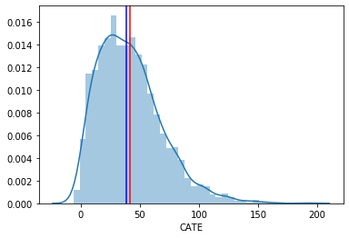
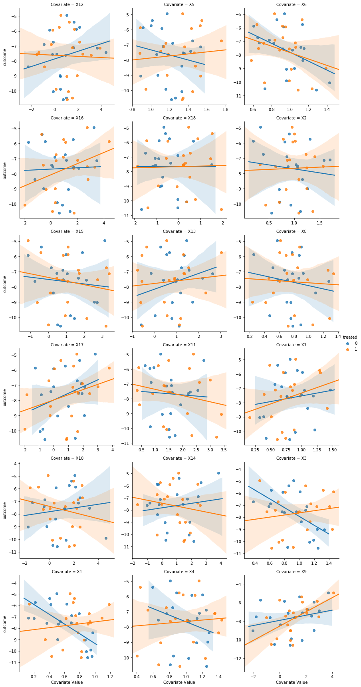
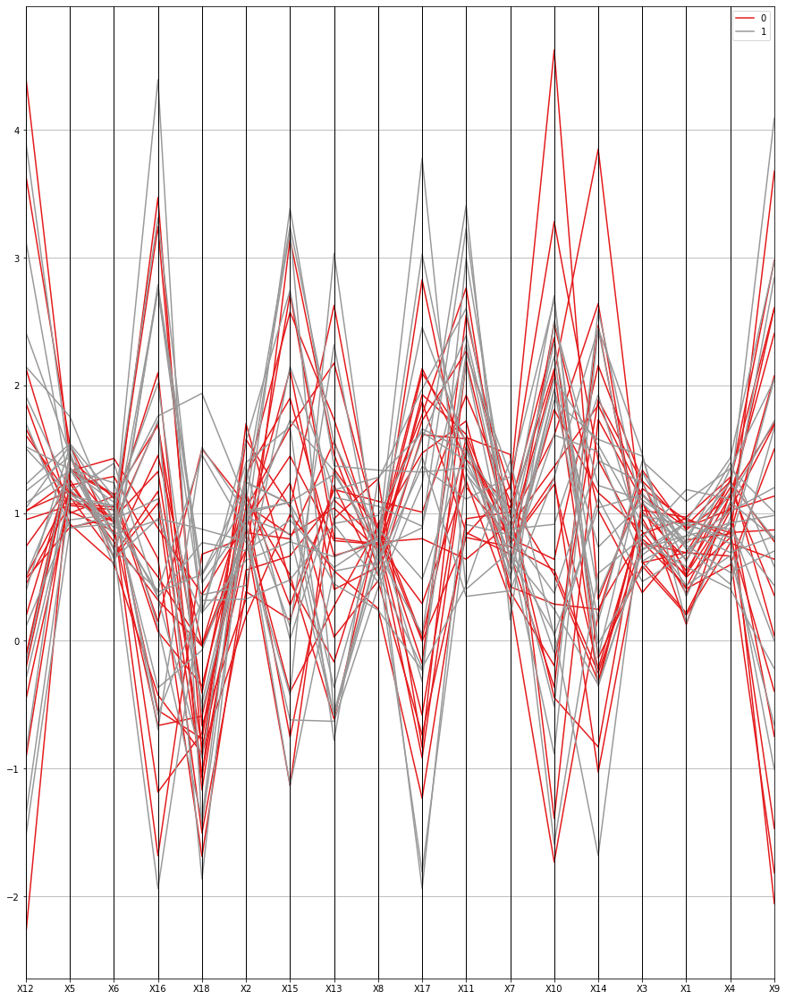

# Introduction
PyMALTS is a learning-to-matching interpretable causal inference method. PyMALTS implements MALTS algorithm proposed by Harsh Parikh, Cynthia Rudin and Alexander Volfovsky in their 2019 paper titled "MALTS: Matching After Learning to Stretch"

# Getting Started
PyMALTS is a Python3 library and it requires numpy, pandas, scikit-learn, matplotlib and seaborn. Let's first import the necessary libraries. 


```python
import pymalts
import pandas as pd
import numpy as np
import matplotlib.pyplot as plt
import seaborn as sns
np.random.seed(0)
```

## Reading the data
We use pandas to read the data from CSV file into a dataframe but you can use your favorite file-reader.


```python
df_train = pd.read_csv('example/example_training.csv',index_col=0)
df_est = pd.read_csv('example/example_estimation.csv',index_col=0)
```

Looking at first few rows of the training data and estimation data.


```python
df_train.head()
```


<div>

<table border="1" class="dataframe">
  <thead>
    <tr style="text-align: right;">
      <th></th>
      <th>X1</th>
      <th>X2</th>
      <th>X3</th>
      <th>X4</th>
      <th>X5</th>
      <th>X6</th>
      <th>X7</th>
      <th>X8</th>
      <th>X9</th>
      <th>X10</th>
      <th>X11</th>
      <th>X12</th>
      <th>X13</th>
      <th>X14</th>
      <th>X15</th>
      <th>X16</th>
      <th>X17</th>
      <th>X18</th>
      <th>outcome</th>
      <th>treated</th>
    </tr>
  </thead>
  <tbody>
    <tr>
      <th>452</th>
      <td>1.819048</td>
      <td>1.647819</td>
      <td>1.308953</td>
      <td>1.734019</td>
      <td>0.855118</td>
      <td>1.977119</td>
      <td>1.350102</td>
      <td>1.680756</td>
      <td>1.461630</td>
      <td>0.182236</td>
      <td>1.814832</td>
      <td>2.414663</td>
      <td>1.349697</td>
      <td>1.689332</td>
      <td>1.908062</td>
      <td>0.213754</td>
      <td>1.995093</td>
      <td>0.229470</td>
      <td>65.357913</td>
      <td>1</td>
    </tr>
    <tr>
      <th>470</th>
      <td>0.391609</td>
      <td>1.680689</td>
      <td>0.800403</td>
      <td>0.966430</td>
      <td>0.520767</td>
      <td>0.509781</td>
      <td>1.089567</td>
      <td>1.135084</td>
      <td>1.573440</td>
      <td>2.104325</td>
      <td>2.164498</td>
      <td>0.770808</td>
      <td>2.872847</td>
      <td>1.335996</td>
      <td>1.922559</td>
      <td>1.194346</td>
      <td>1.144125</td>
      <td>0.786834</td>
      <td>-8.773791</td>
      <td>0</td>
    </tr>
    <tr>
      <th>311</th>
      <td>2.002644</td>
      <td>1.936058</td>
      <td>1.684250</td>
      <td>1.817321</td>
      <td>2.370025</td>
      <td>2.194189</td>
      <td>1.506828</td>
      <td>2.023798</td>
      <td>-1.818878</td>
      <td>-0.173793</td>
      <td>-1.103308</td>
      <td>-1.182929</td>
      <td>-0.728503</td>
      <td>1.144823</td>
      <td>1.438420</td>
      <td>2.330082</td>
      <td>1.169831</td>
      <td>0.955778</td>
      <td>-15.044913</td>
      <td>0</td>
    </tr>
    <tr>
      <th>243</th>
      <td>0.944754</td>
      <td>1.165708</td>
      <td>0.932396</td>
      <td>1.807640</td>
      <td>0.532053</td>
      <td>0.527254</td>
      <td>0.537563</td>
      <td>0.692490</td>
      <td>-1.447944</td>
      <td>-1.974136</td>
      <td>2.079438</td>
      <td>1.496016</td>
      <td>0.418019</td>
      <td>3.421552</td>
      <td>-1.644336</td>
      <td>0.551145</td>
      <td>0.577592</td>
      <td>0.263000</td>
      <td>-5.346794</td>
      <td>0</td>
    </tr>
    <tr>
      <th>155</th>
      <td>2.390528</td>
      <td>1.509044</td>
      <td>1.675889</td>
      <td>1.589362</td>
      <td>1.636131</td>
      <td>1.678246</td>
      <td>1.755178</td>
      <td>1.312119</td>
      <td>-2.048745</td>
      <td>0.335748</td>
      <td>2.007166</td>
      <td>2.626542</td>
      <td>1.414703</td>
      <td>0.826678</td>
      <td>2.482560</td>
      <td>1.616941</td>
      <td>0.059490</td>
      <td>0.780916</td>
      <td>-17.352554</td>
      <td>0</td>
    </tr>
  </tbody>
</table>
</div>


```python
df_est.head()
```


<div>

<table border="1" class="dataframe">
  <thead>
    <tr style="text-align: right;">
      <th></th>
      <th>X1</th>
      <th>X2</th>
      <th>X3</th>
      <th>X4</th>
      <th>X5</th>
      <th>X6</th>
      <th>X7</th>
      <th>X8</th>
      <th>X9</th>
      <th>X10</th>
      <th>X11</th>
      <th>X12</th>
      <th>X13</th>
      <th>X14</th>
      <th>X15</th>
      <th>X16</th>
      <th>X17</th>
      <th>X18</th>
      <th>outcome</th>
      <th>treated</th>
    </tr>
  </thead>
  <tbody>
    <tr>
      <th>1355</th>
      <td>1.881335</td>
      <td>1.684164</td>
      <td>0.532332</td>
      <td>2.002254</td>
      <td>1.435032</td>
      <td>1.450196</td>
      <td>1.974763</td>
      <td>1.321659</td>
      <td>0.709443</td>
      <td>-1.141244</td>
      <td>0.883130</td>
      <td>0.956721</td>
      <td>2.498229</td>
      <td>2.251677</td>
      <td>0.375271</td>
      <td>-0.545129</td>
      <td>3.334220</td>
      <td>0.081259</td>
      <td>-15.679894</td>
      <td>0</td>
    </tr>
    <tr>
      <th>1320</th>
      <td>0.666476</td>
      <td>1.263065</td>
      <td>0.657558</td>
      <td>0.498780</td>
      <td>1.096135</td>
      <td>1.002569</td>
      <td>0.881916</td>
      <td>0.740392</td>
      <td>2.780857</td>
      <td>-0.765889</td>
      <td>1.230980</td>
      <td>-1.214324</td>
      <td>-0.040029</td>
      <td>1.554477</td>
      <td>4.235513</td>
      <td>3.596213</td>
      <td>0.959022</td>
      <td>0.513409</td>
      <td>-7.068587</td>
      <td>0</td>
    </tr>
    <tr>
      <th>1233</th>
      <td>-0.193200</td>
      <td>0.961823</td>
      <td>1.652723</td>
      <td>1.117316</td>
      <td>0.590318</td>
      <td>0.566765</td>
      <td>0.775715</td>
      <td>0.938379</td>
      <td>-2.055124</td>
      <td>1.942873</td>
      <td>-0.606074</td>
      <td>3.329552</td>
      <td>-1.822938</td>
      <td>3.240945</td>
      <td>2.106121</td>
      <td>0.857190</td>
      <td>0.577264</td>
      <td>-2.370578</td>
      <td>-5.133200</td>
      <td>0</td>
    </tr>
    <tr>
      <th>706</th>
      <td>1.378660</td>
      <td>1.794625</td>
      <td>0.701158</td>
      <td>1.815518</td>
      <td>1.129920</td>
      <td>1.188477</td>
      <td>0.845063</td>
      <td>1.217270</td>
      <td>5.847379</td>
      <td>0.566517</td>
      <td>-0.045607</td>
      <td>0.736230</td>
      <td>0.941677</td>
      <td>0.835420</td>
      <td>-0.560388</td>
      <td>0.427255</td>
      <td>2.239003</td>
      <td>-0.632832</td>
      <td>39.684984</td>
      <td>1</td>
    </tr>
    <tr>
      <th>438</th>
      <td>0.434297</td>
      <td>0.296656</td>
      <td>0.545785</td>
      <td>0.110366</td>
      <td>0.151758</td>
      <td>-0.257326</td>
      <td>0.601965</td>
      <td>0.499884</td>
      <td>-0.973684</td>
      <td>-0.552586</td>
      <td>-0.778477</td>
      <td>0.936956</td>
      <td>0.831105</td>
      <td>2.060040</td>
      <td>3.153799</td>
      <td>0.027665</td>
      <td>0.376857</td>
      <td>-1.221457</td>
      <td>-2.954324</td>
      <td>0</td>
    </tr>
  </tbody>
</table>
</div>


# Using MALTS
## Distance metric learning
Setting up the model for learning the distance metric.

1) Variable name for the outcome variable: 'outcome'. 
2) Variable name for the treatment variable: 'treated'


```python
m = pymalts.malts( outcome='outcome', treatment='treated', data=df_train, discrete=[], k=10 )
```

Fitting the model


```python
res = m.fit()
```

## Getting Matched Groups


```python
mg = m.get_matched_groups(df_estimation = df_est, k=20 )
```

## Estimating Conditional Average Treatment Effect (CATE)
Fit linear regression models for control and treated units inside the matched group and use the difference of the estimated treatment and control potential outcomes for the unit of interest as it's corresponding CATE estimate.


```python
cate = m.CATE( mg, model='linear' )
```

Looking at the estimated CATEs for first few units


```python
cate.head()
```


<div>

<table border="1" class="dataframe">
  <thead>
    <tr style="text-align: right;">
      <th></th>
      <th>CATE</th>
      <th>outcome</th>
      <th>treatment</th>
    </tr>
  </thead>
  <tbody>
    <tr>
      <th>0</th>
      <td>72.115699</td>
      <td>-15.679894</td>
      <td>0</td>
    </tr>
    <tr>
      <th>1</th>
      <td>23.664641</td>
      <td>-7.068587</td>
      <td>0</td>
    </tr>
    <tr>
      <th>2</th>
      <td>29.161183</td>
      <td>-5.133200</td>
      <td>0</td>
    </tr>
    <tr>
      <th>3</th>
      <td>52.595566</td>
      <td>39.684984</td>
      <td>1</td>
    </tr>
    <tr>
      <th>4</th>
      <td>4.643755</td>
      <td>-2.954324</td>
      <td>0</td>
    </tr>
  </tbody>
</table>
</div>


PyMALTS also allows estimating CATEs by vanilla average between treated and control units inside a matched group


```python
cate_mean = m.CATE( mg, model='mean' )
cate_mean.head()
```


<div>

<table border="1" class="dataframe">
  <thead>
    <tr style="text-align: right;">
      <th></th>
      <th>CATE</th>
      <th>outcome</th>
      <th>treatment</th>
    </tr>
  </thead>
  <tbody>
    <tr>
      <th>0</th>
      <td>64.714527</td>
      <td>-15.679894</td>
      <td>0</td>
    </tr>
    <tr>
      <th>1</th>
      <td>28.313943</td>
      <td>-7.068587</td>
      <td>0</td>
    </tr>
    <tr>
      <th>2</th>
      <td>26.927607</td>
      <td>-5.133200</td>
      <td>0</td>
    </tr>
    <tr>
      <th>3</th>
      <td>52.828022</td>
      <td>39.684984</td>
      <td>1</td>
    </tr>
    <tr>
      <th>4</th>
      <td>5.914307</td>
      <td>-2.954324</td>
      <td>0</td>
    </tr>
  </tbody>
</table>
</div>


Plotting the probability distribution of CATE.


```python
sns.distplot(cate['CATE'])
plt.axvline(np.mean(cate['CATE']),c='red')
plt.axvline(np.median(cate['CATE']),c='blue')
```


    <matplotlib.lines.Line2D at 0x1a176aed10>





## Estimating the Average Treatment Effect (ATE)
We use law of iterated expectation to estimate ATE. Thus, we use 


```python
ate = np.mean(cate['CATE'])
ate
```


    41.709461029592596


# Visualization
PyMALTS also provides tools to visualize inside each matched group. The tools plots a scatter plot of outcome versus each covariate, and the color shows if the point is treated or control.


```python
df_mg1 = m.visualizeMG( MG=mg, a=10 )
```


    <Figure size 432x288 with 0 Axes>








```python

```
